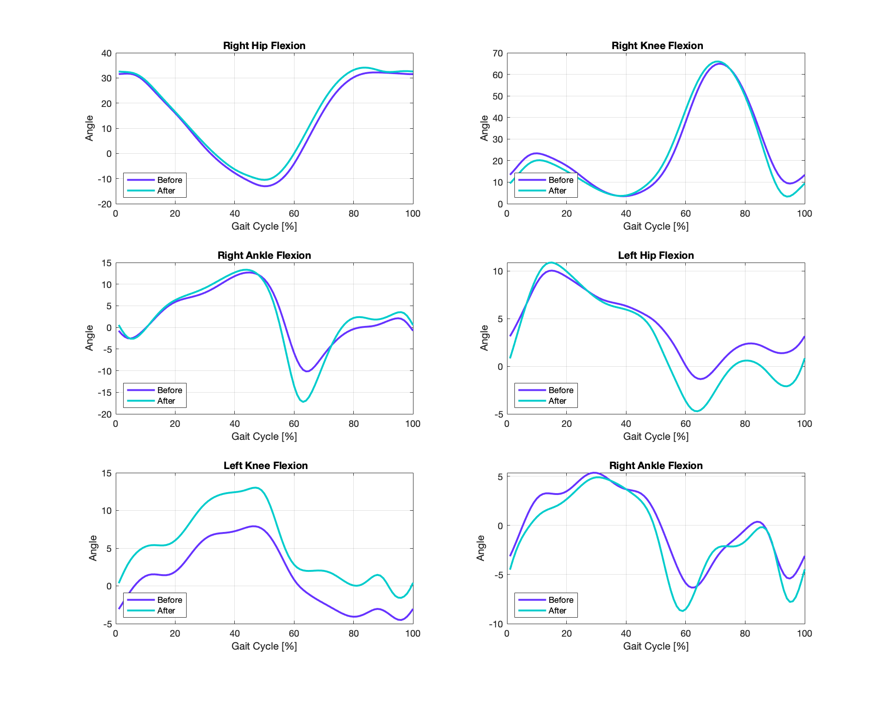
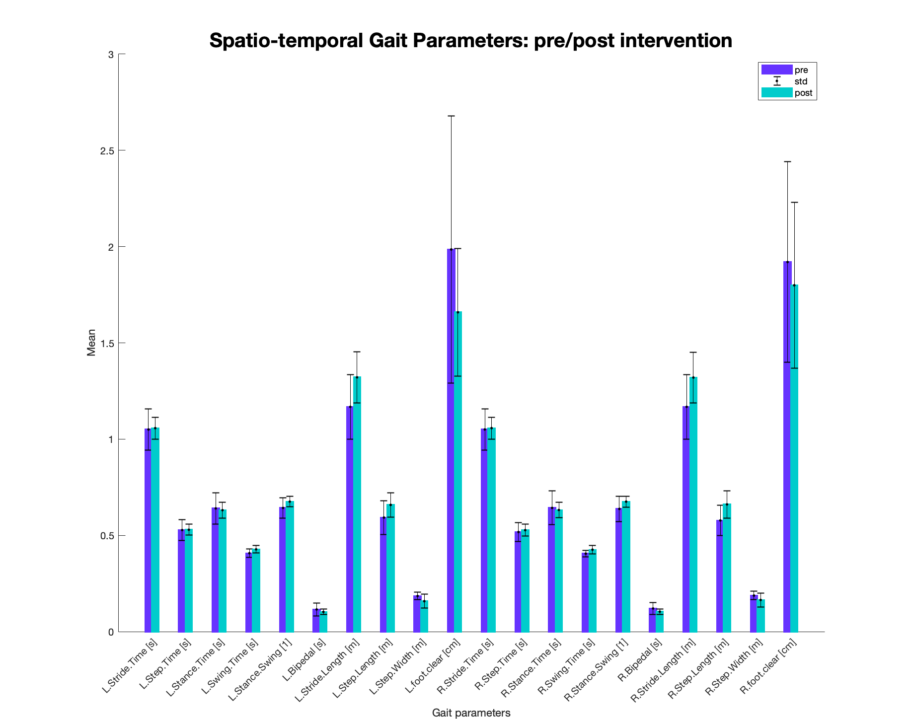

# How to use Moveshelf MATLAB API 🥰

The Moveshelf MATLAB API uses a [Python API](https://github.com/moveshelf/python-api-example) to access the cloud database through [GraphQL](https://graphql.org).
The Python API can be found on GitHub and works autonomously, so if you know a bit of Python, go for it 😄.
For the MATLAB API , an additional Python interface is added (*PYinterface.py*) for a more smooth collaboration with MATLAB. However,  if you are not a Python expert or just don’t want to try to figure it out, don’t worry you don’t have to use it at all 😄.

## **SetUp**

### Python3

The MATLAB API works with Python3, so remember to check if your version is updated. 
If you work with iOS, the problem is a bit more complicated if you don’t have Python3 already. iOS has Python2 integrated, so you have to install Python3 on your MacBook on a virtual environment (you can check [this](https://code.visualstudio.com/docs/python/python-tutorial) for help).
Moreover, another problem might arise while using MATLAB on MacBook, since MATLAB would run Python2 even if you have already installed Python3 😅, here [this](https://erikreinertsen.com/python3-in-matlab/) is really useful. The few lines of code are already implemented in the MATLAB API, you just have to paste your $PATH from terminal in pathOK variable.

### Python libraries

Check if you have installed all the required libraries: json, os, numpy, pandas, base64, logging, re, struct, crcmod, requests, six, mkPredefinedCrcFun (from crcmod.predefined), TypedDict (from mypy_extensions), or just enter:

```
pip install -r LibRequirements.txt
```

### API key 🔐

To access the Moveshelf database, an access key needs to be created: login to [Moveshelf](https://moveshelf.com), navigate to your profile, in the API Keys section, under your avatar, enter an ID for the new key (e.g. “api_test”), click on “Generate API Key” and “Download Key” to save the API on your computer in json file. The key file does not have to be in the main directory, just remember where you saved it 😜.

**The API key should be kept secret 🤫.**

Now, the MATLAB API should work perfectly without problems 😄 and you can start downloading/uploading your data and performing the desired data analysis entirely on MATLAB! 🥳📊📉.
Enjoy! 😄

## **matlabAPI_1.m**

MATLAB — Moveshelf main interface

First run section 0 first once, then each section can be run independently

### section**0**

Set main path: set the directory (i.e. the folder with all of your MATLAB API files 🤓) on MATLAB GUI, then run pwd on the command window, and, finally, copy and paste the result in mainPath variable.
Select ApiKey 🔐 (see above), a selection window should appear and you just have to select your ApiKey file :)

—> this section creates a Project struct with all project’s ids and names.

### section**1**

DisplayProjects.m function, guess what, displays all projects in a numbered list 😄.
For DisplayProjectsClips.m you have to choose how many clips you want to display for each project.
The second function also adds the clips in the Project struct, as shown in the figure.

### section**2**

UploadFile.m needs a project number from the projects list provided by DisplayProjects.m, where the new file is going to be uploaded.
Then you can select the file you want to upload on the database, the file is supposed to be in xlsx format.
You can also check if your file has been uploaded (if you don’t trust MATLAB’s messages 😜) by running section1 or simply checking on the [website](https://moveshelf.com).

### section**3**

DownloadData.m needs the clipID of the file you want to download locally (or more clipIDs simultaneously).

—> CreateMATstruct.m transforms json data downloaded from Moveshelf into MATLAB struct and saves the struct inside the folder of downloaded data.

### section**4**

You can modify the clip’s name, by entering the clipID and the new name as a string.
You can also move the clip from one project to another by entering the project’s name, otherwise you can leave it empty ([ ]) and the clip will stay in the current project.
You can obviously just move the file without changing its name 😄.
Obviously, you can also check the modified name by displaying the clips (*section1*).

### section**5**

To eliminate a clip (or more clips) you have to enter the clipID(s).
Also here you can check if the clip has been deleted by displaying the clips (*section1*).

### section**A**

Now, data from the created struct can be used to perform data analysis on MATLAB on the same trial (**A1** DataAnalysis.m) or a comparison between more trials (**A2** GaitCompare.m) or whatever you desire to do, the data is easily accessible 😄. The provided examples are suitable only for data with angles.m and gait_params.m files.

You need to access the folder of your MATLAB struct thought clipID, in order to find the right struct and perform the data analysis.

—> you can find an example below!

### example of data analysis

* a comparison between pre-intervention motion data and post-intervention: spatio-temporal gait parameters
* joint angles during gait before and after intervention


